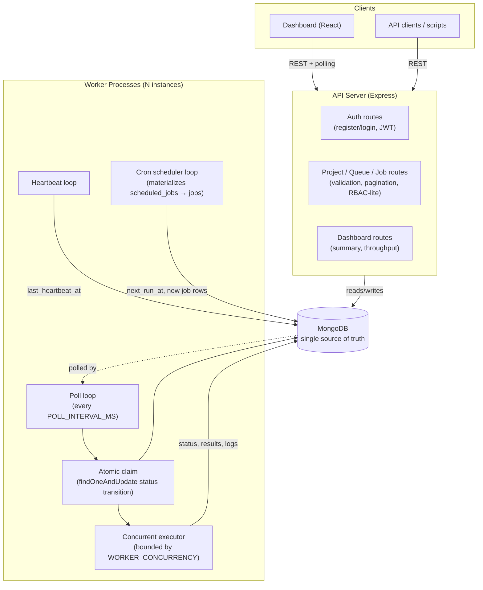
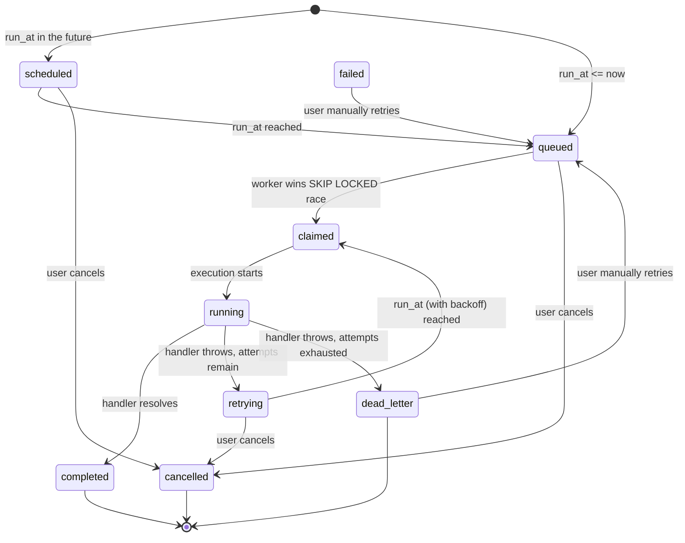

# Architecture

## Overview

Relay has three independently-runnable components that all talk to a single
MongoDB database — there is no message broker and no separate lock service.
MongoDB itself provides atomicity (via `findOneAndUpdate` with a status
transition) and durability, which keeps the system simple to reason about
while still being safe under concurrent workers.

## Component responsibilities

**API server** (`server/src/index.ts` + `routes/`)
Stateless Express app. Handles auth (JWT), project/queue/job CRUD,
validation (Zod), pagination, and read-only dashboard aggregation queries.
Any number of instances can run behind a load balancer — it holds no
in-memory state, so horizontal scaling is a non-issue.

**Worker service** (`server/src/worker.ts`)
A separate process from the API server, deliberately — job execution
throughput needs to scale independently of API traffic, and a slow job
should never be able to block an API request. Each worker instance runs
four independent loops on its own timers:
- **poll loop** — claims and executes jobs
- **heartbeat loop** — reports liveness to the `workers` collection
- **scheduler loop** — turns due cron templates into real job documents
- (execution itself happens inline inside the poll loop's claimed-job handler, bounded by a concurrency counter)

**Dashboard** (`client/`)
A React SPA that talks to the same REST API a script would. It polls
(every 3–5s depending on the page) rather than using WebSockets — see
`design-decisions.md` for why that trade-off was made deliberately here.

**Database**
MongoDB is the only stateful component. It is simultaneously the job
queue, the lock manager (via `findOneAndUpdate` atomic status transitions),
the results store, and the audit log. See `er-diagram.md`.

## Job lifecycle

Note `failed` exists as a status value for completeness (e.g. an operator
force-failing a job) but the worker itself only ever transitions a failed
attempt straight to `retrying` or `dead_letter` — it never leaves a job
sitting in plain `failed` mid-lifecycle, since that would be an ambiguous
state (is it about to retry, or not?).

## Concurrency & reliability mechanisms

| Concern | Mechanism |
|---|---|
| No two workers claim the same job | `findOneAndUpdate` with an atomic `queued→claimed` status transition — MongoDB's document-level locking ensures only one writer wins per document |
| A worker crashes mid-job | Job stays `claimed`/`running` with a `claimed_by` pointing at a worker whose heartbeats have stopped — an operator can detect this via the Workers page and manually retry (see design-decisions.md for the trade-off here) |
| Queue-level concurrency limits are respected | Worker computes `concurrency_limit - running_count` per queue before claiming, so no queue is ever over-subscribed even across multiple worker processes |
| Retries don't hammer a failing dependency | Configurable fixed/linear/exponential backoff, clamped to `max_delay_seconds` |
| Permanent failures don't get lost | Moved to `dead_letter_entries` with the final error and full payload, independent of the `jobs` row's lifecycle |
| Graceful shutdown | `SIGTERM`/`SIGINT` stops the poll and scheduler loops immediately, then waits (up to 30s) for in-flight jobs to finish before marking the worker `offline` |
| Idempotency | Optional `idempotency_key` per queue de-dupes job creation at the API layer |
