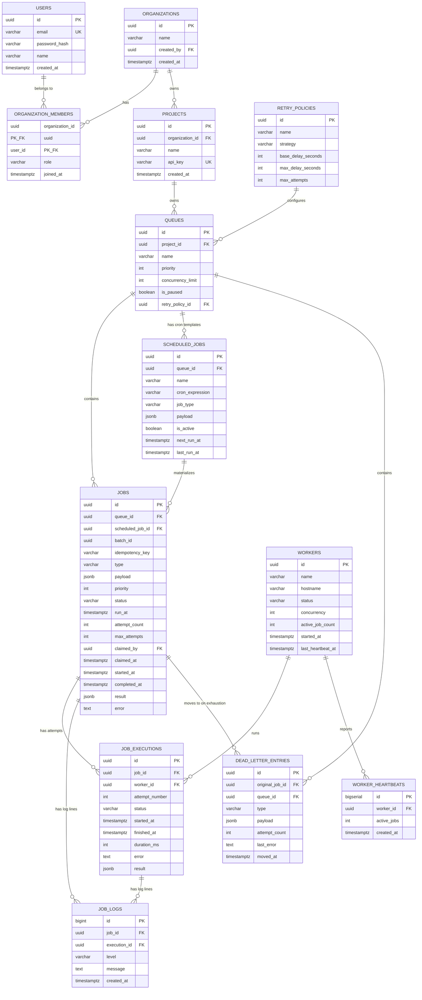

# Entity-Relationship Diagram

The database is MongoDB. Collections mirror the relational schema below
(each entity is a MongoDB collection; `id` fields are UUIDs rather than
ObjectIds, kept for API compatibility). The init script is `db/init-mongo.js`.
The original PostgreSQL schema is preserved in `db/schema.sql` for reference.



## Design notes

**Keys.** Every collection uses a `uuid` string `id` field as the logical
primary key (generated with the `uuid` package), stored alongside MongoDB's
native `_id`. UUIDs are used throughout for API-level identifiers to avoid
exposing sequential internal IDs and to allow client-side pre-generation.
High-write, append-only collections (`job_logs`, `worker_heartbeats`) also
use UUIDs for consistency.

**References & cascading.** MongoDB has no native foreign-key cascade.
Reference integrity is enforced at the application layer. Deleting a queue
or project requires the application to clean up downstream documents
(jobs, executions, logs). The schema is designed so that an entry in
`dead_letter_entries` carries its own denormalized `payload`, `type`, and
`last_error`, so the audit trail survives even if the original job document
is later purged.

**Normalization.** The document model is deliberately flat where practical —
retry policy fields are stored in a `retry_policies` collection and
referenced by `id` from queues, but `jobs.max_attempts` is copied at
job-creation time (intentional denormalization): if an operator changes a
queue's retry policy, jobs already in flight should keep behaving under the
policy they were created under.

**Indexes.** The single most important index is the partial index on `jobs`
covering the claimable subset:

```js
db.jobs.createIndex(
  { queue_id: 1, status: 1, run_at: 1, priority: -1 },
  { partialFilterExpression: { status: { $in: ['queued', 'retrying'] } } }
);
```

This partial index only covers the small, active set of documents a worker
needs to scan — not the ever-growing mass of `completed` history. The
unique partial index on `(queue_id, idempotency_key)` (where not null)
enforces idempotent job creation at the database level.

**Performance considerations at scale.** For very high job volumes, the next
steps would be: sharding the `jobs` collection by `queue_id`, archiving old
`completed`/`failed` documents to a separate collection or time-series
store, and moving `job_logs` to a dedicated log store (e.g. MongoDB Atlas
Search or an external observability platform).
